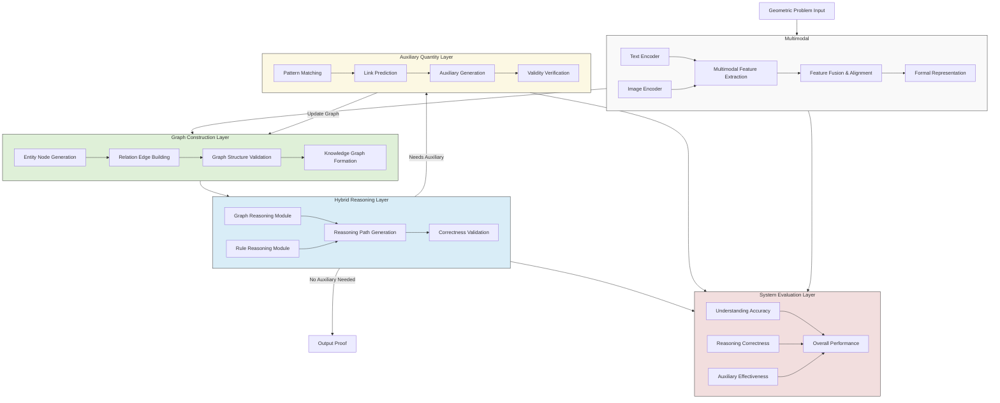

```mermaid
flowchart TB
    Input["Geometric Problem Input"] --> Multimodal["Multimodal Understanding Layer"]
    
    subgraph Multimodal
        M1["Text Encoder"]
        M2["Image Encoder"]
        M3["Multimodal Feature Extraction"]
        M4["Feature Fusion & Alignment"]
        M5["Formal Representation"]
        
        M1 & M2 --> M3
        M3 --> M4
        M4 --> M5
    end
    
    subgraph GraphConstruction["Graph Construction Layer"]
        G1["Entity Node Generation"]
        G2["Relation Edge Building"]
        G3["Graph Structure Validation"]
        G4["Knowledge Graph Formation"]
        
        G1 --> G2
        G2 --> G3
        G3 --> G4
    end
    
    subgraph ReasoningSystem["Hybrid Reasoning Layer"]
        R1["Graph Reasoning Module"]
        R2["Rule Reasoning Module"]
        R3["Reasoning Path Generation"]
        R4["Correctness Validation"]
        
        R1 & R2 --> R3
        R3 --> R4
    end
    
    subgraph AuxiliaryRecommendation["Auxiliary Quantity Layer"]
        A1["Pattern Matching"]
        A2["Link Prediction"]
        A3["Auxiliary Generation"]
        A4["Validity Verification"]
        
        A1 --> A2
        A2 --> A3
        A3 --> A4
    end
    
    subgraph Evaluation["System Evaluation Layer"]
        E1["Understanding Accuracy"]
        E2["Reasoning Correctness"]
        E3["Auxiliary Effectiveness"]
        E4["Overall Performance"]
        
        E1 & E2 & E3 --> E4
    end
    
    Multimodal --> GraphConstruction
    GraphConstruction --> ReasoningSystem
    ReasoningSystem --> |"Needs Auxiliary"| AuxiliaryRecommendation
    AuxiliaryRecommendation --> |"Update Graph"| GraphConstruction
    ReasoningSystem --> |"No Auxiliary Needed"| Output["Output Proof"]
    
    ReasoningSystem & AuxiliaryRecommendation & Multimodal --> Evaluation
    
    style Multimodal fill:#f9f9f9,stroke:#333
    style GraphConstruction fill:#dff0d8,stroke:#333
    style ReasoningSystem fill:#d9edf7,stroke:#333
    style AuxiliaryRecommendation fill:#fcf8e3,stroke:#333
    style Evaluation fill:#f2dede,stroke:#333
```